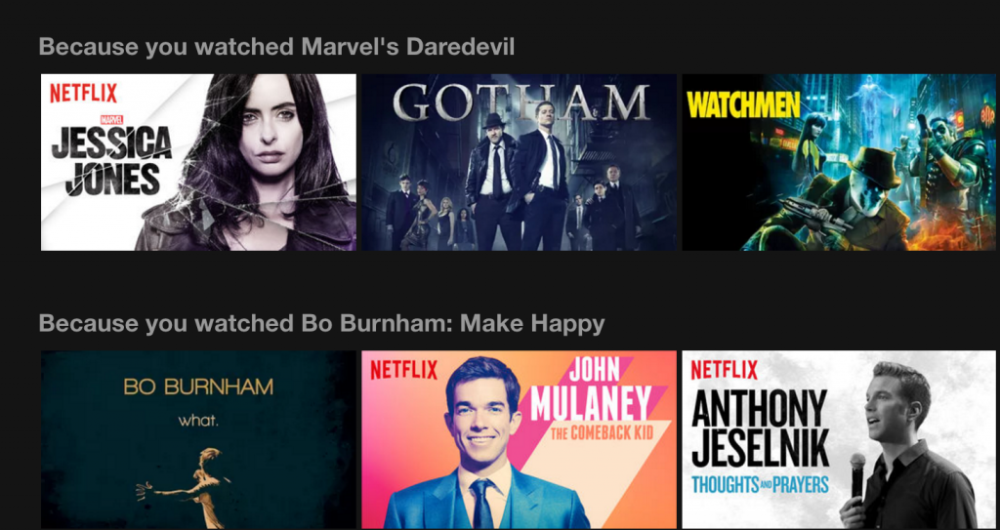

## Building a MovieLens Recommender System

### TMLS 2020 Workshop 

Want to know how Spotify, Amazon, and Netflix generate recommendations for their users? In this introductory workshop, we'll learn how to build collaborative filtering and content-based filtering recommender systems using the [MovieLens](https://grouplens.org/datasets/movielens/) dataset.  

We'll be using these packages to do our analysis:

- [pandas](https://pandas.pydata.org/)
- [numpy](https://numpy.org/)
- [matplotlib](https://matplotlib.org/)
- [seaborn](https://seaborn.pydata.org/)
- [scikit-learn](https://scikit-learn.org/stable/)
- [fuzzywuzzy](https://pypi.org/project/fuzzywuzzy/)